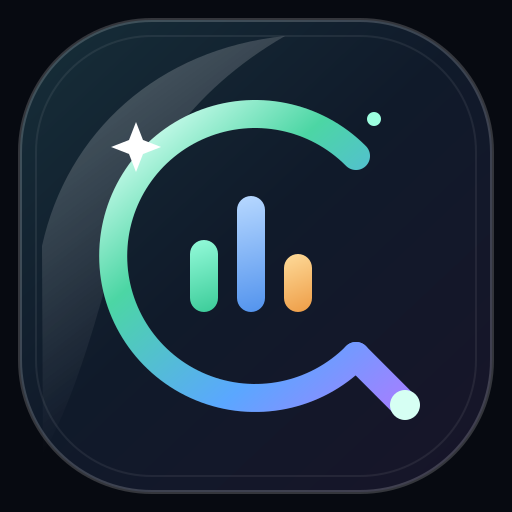
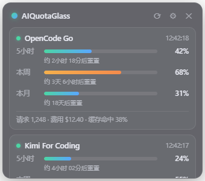
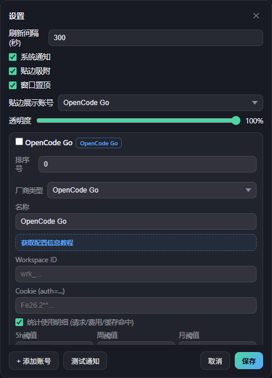
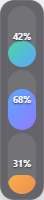

# AIQuotaGlass

多厂商 AI 套餐 / API 用量定时刷新与阈值告警的 Windows 桌面悬浮工具。

<p align="center">
  
</p>

透明玻璃拟态、无边框、置顶、贴边吸附，不遮挡桌面工作区。

> **⚠ 免责声明**
>
> 本项目全部代码由 AI（DeepSeek V4 Flash 等）vibe coding 生成，源码完全公开、未做代码签名，发布包由 GitHub Actions 自动构建。部分杀毒软件可能误报，属正常现象；程序会读取网络数据、写入配置并显示系统通知，全部行为均可在源码中核实。项目以自用为主，使用风险自负；不放心的建议先让 AI 分析源码再自行构建（`wails3 build`），产物行为完全一致。

## 效果预览

主窗口展示多个厂商的 5 小时、本周、本月用量进度，以及重置倒计时和使用明细。



设置面板支持全局选项、厂商账号、阈值、透明度和贴边展示账号配置。



窗口贴边后自动收缩为三条紧凑进度条，点击即可恢复完整窗口。



## 功能

- 定时自动刷新（默认 5 分钟）多个厂商的套餐 / API 用量
- 每个用量窗口（5小时 / 本周 / 本月限额）独立进度条 + 重置倒计时
- 阈值告警：应用内提示 + Windows 系统通知（边缘触发去重）
- 使用明细统计：请求数、费用、缓存命中率
- 悬浮窗：可拖拽、贴边吸附、置顶、透明度调节
- 配置（厂商 / 凭据 / 阈值 / 间隔）通过设置面板维护，持久化到本地，凭据 DPAPI 加密存储

## 已支持厂商

| 类型 | 查询方式 |
|---|---|
| OpenCode Go | 会话 Cookie + Workspace（SSR 页面解析） |
| 智谱 GLM | API Key（Coding Plan 用量接口） |
| Kimi For Coding | API Key |
| MiniMax | API Key |
| New API | API Key（自建中转面板令牌额度） |
| Sub2API | API Key（自建中转面板配额 / 订阅限额 / 今日·近30天费用） |

扩展新厂商只需在 `internal/providers/` 加一个 Go 文件——见[厂商插件开发指南](docs/PROVIDER_GUIDE.md)。

## 快速开始

前置要求：Go 1.25+、Node.js、Wails v3 CLI（`go install github.com/wailsapp/wails/v3/cmd/wails3@v3.0.0-alpha2.119`）。

```powershell
wails3 build          # 生产构建: bin\aiquotaglass.exe
.\bin\aiquotaglass.exe
```

开发热重载：`wails3 dev`。运行数据（配置 + WebView2 缓存）默认位于 `%USERPROFILE%\.config\AIQuotaGlass`，可用环境变量 `AQUOTA_CONFIG_DIR` 覆盖。

### 配置厂商

点击悬浮窗 ⚙ 打开设置面板，「+ 添加账号」选择厂商类型，按卡片内教程获取并填写凭据（cookie / API Key），保存即自动刷新。

凭据由用户自行从厂商控制台 / DevTools 复制，应用不接触浏览器，不记录、不上传任何使用数据。

## 技术栈

Go 1.25 + [Wails v3](https://v3.wails.io)（alpha2.119，锁定）+ WebView2 + 原生 TypeScript / Vite，无前端框架依赖。

## 文档

- [设计文档](docs/DESIGN.md) — 架构、数据流、模块说明
- [厂商插件开发指南](docs/PROVIDER_GUIDE.md) — 如何新增一个厂商
- [AGENTS.md](AGENTS.md) — 开发者约定与已知坑

## License

[MIT](LICENSE)
